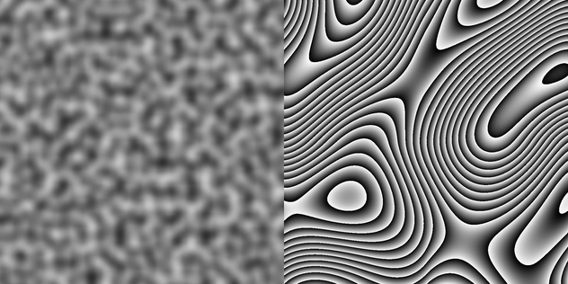
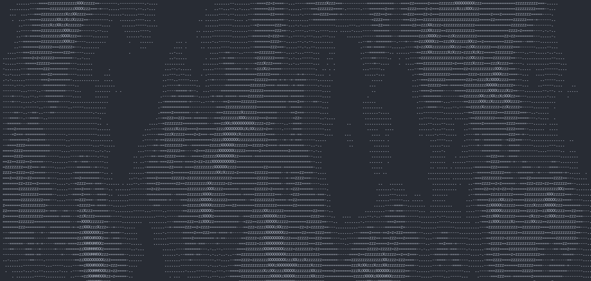

# Terms and Definitions

# 1. Noise.

Noise in the context of Computer Science / Computer Graphics is not noise generated by your computer fans, but by a linear algebra algorithm. 

Take a look at the below images:

These two images are both generated using Simplex noise. For each image, simplex noise values were generated for each pixel. Then, the programmed made each value correlate with a color value between `white` and `black`. 
In the first image, this was done directly. Values were generated in a range between 0 and 255, where 0 is white and 255 is black. In the second image, the programmer "stepped" the values using their own algorithm to create their image. 
Its important to realize that Simplex Noise does not make these images, rather programmers can use the values they return to create may different things. 

# 2. Noisemap. 

A noisemap is an Array/List/Vector/Set of generated noise values. For example, we could think of the images above as giant arrays, as wide and long as the image is. Each pixel has a corresponding array element, which contains data about how `white` or `black` the pixel is.  

In simple-simplex, there are no methods to create noisemaps, but it is easy to create a method for it yourself with a noise configuration and the `generate` method. 

# 2. Simplex Noise.

Simplex Noise is an updated and improved version of Perlin Noise, and both are created by Ken Perlin. For a more in-depth explanation, read [this article by Stefan Gustavson](https://weber.itn.liu.se/~stegu/simplexnoise/simplexnoise.pdf).

Simplex Noise, very simply put, is a linear algebra algorithm that generates values procedurally.  When these values are put together, they form waves. Simplex Noise algorithms take an `input` and have an `output`. The `input` for 2-dimensional simplex noise is an `x` and a `y` variable, where X and Y are indices in an array or coordinates in a game world. 

# 3. Fractal Brownian Motion (FBM)

Fractal Brownian Motion is NOT a noise algorithm. FBM is an algorithm for *combining* multiple noise values together. Take a look at the images below:

*WITHOUT FBM* ( 0 octaves ) 

*WITH FBM* (5 octaves)

You can see the difference FBM makes. The degree of FBM applied is tied to the `octaves` variable, which controls how many times FBM is applied. When `octaves` is set to 0, no FBM is applied. 
For more information, read docs/NOISECONFIG.md. 

You can read [this article by Patricio Gonzalez Vivo & Jen Love](https://thebookofshaders.com/13/) for a more in-depth explanation of FBM. 

